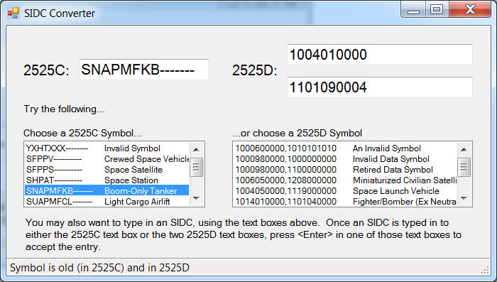

# joint-military-symbology-xml
Joint Military Symbology XML (JointMilSyML or JMSML) is an XML schema, and associated instance data, designed to definitively document the contents of MIL-STD 2525D.

The purpose of defining this schema and populating its associated instance data is four-fold:
  * To aid in the configuration management (CM) of these standards.
  * To provide implementors with a machine-readable form of the contents of these standards.
  * To help support legacy military symbology systems by providing bi-directional lookup of SIDCs.
  * To aid in migrating old military symbology information to the latest version of these standards.

In providing this schema, files of instance data, and sample C# code to navigate same, it is hoped that future defense and intelligence systems will be engineered to take advantage of this technology and, in so doing, accelerate the delivery of new military symbology, reflected in updates to these standards, to warfighters.

**Repo Owners: Joe Bayles ([joebayles](https://github.com/joebayles)) and Daniel Barnes ([Dbarnes1](https://github.com/Dbarnes1))**

## Features

* Schema (xsd) files for:
  * Commonly used types.
  * The base portion (part one) of a military symbol ID code (SIDC).
  * The symbol set portion (part two) of a military symbol ID code (SIDC).

* Instance (xml) files for:
  * The base portion of the two standards.
  * Each symbol set, including all legacy symbols from 2525C and Bc2, for all relevant appendices/chapters.

* SVG files for all of the frames, entities, modifiers, and other graphic amplifiers needed to implement military symbology.

* A .Net (C#) solution that contains projects with all the code to:
  * Define all the classes needed to import the XML instance data.
  * Navigate the aforementioned classes to perform the following functions:
    * Convert from old style 15-character SIDC to new style 20-digit SIDC.
    * Convert from new style 20-digit SIDC to old style 15-character SIDC.
  * Test the above functions.

## Sections

* [Requirements](#requirements)
* [Instructions](#instructions)
* [NLog](#nlog)
* [Svg](#svg)
* [Documentation](#documentation)
* [Versioning](#versioning)
* [Resources](#resources)
* [Issues](#issues)
* [Contributing](#contributing)
* [Licensing](#licensing)

## Requirements

* A text editor of your choice for viewing and/or editing the XML files found under the instance or schema folders.
* To build the .NET Solution source in source\JointMilitarySymbologyLibraryCS you will also need:
    * Visual Studio 2012 or later.
    * NLog (see below).
    * Svg (see below, if you wish to build/run the JMSML Demo project).
    * If you do not require the C# library, you may skip this requirement.

## Instructions

### General Help
[New to Github? Get started here.](http://htmlpreview.github.com/?https://github.com/Esri/esri.github.com/blob/master/help/esri-getting-to-know-github.html)

### Getting Started with the solution
* If you intend to use the SVG files with the image conversion utilities found under the Utilities source folder, please consult its instructions [here](./source/utilities/image-conversion-utilities/README.md).
* Open and build the Visual Studio Solution at joint-military-symbology-xml\source\JointMilitarySymbologyLibraryCS
    * To use MSBuild to build the solution
        * Open a Visual Studio Command Prompt: Start Menu | Microsoft Visual Studio 2012 | Visual Studio Tools | Developer Command Prompt for VS 2012
        * `cd joint-military-symbology-xml\source\JointMilitarySymbologyLibraryCS`
        * `msbuild JointMilitarySymbologyLibrary.sln /property:Configuration=Release`
            * NOTE: if you recieve an error message: `'msbuild' is not recognized` 
            * You may need to add the path to the .NET Framework SDK (if multiple SDKs are installed)
            * E.g. `set path=%path%;C:\Windows\Microsoft.NET\Framework\v4.0.30319`
* Use the UnitTests project and the Visual Studio Test tools to run the unit tests provided.  These will test various aspects of the source used to navigate the XML data and convert symbol ID codes (SIDC) from one military symbology standard to another.
* To run the unit tests from a command line:
	* Open a Visual Studio Command Prompt: Start Menu | Microsoft Visual Studio 2012 | Visual Studio Tools | Developer Command Prompt for VS 2012
        * `cd joint-military-symbology-xml\source\JointMilitarySymbologyLibraryCS`
        * `MSTest /testmetadata:JointMilitarySymbologyLibrary.vsmdi /testlist:"JMSML Tests"`
* Run the Test project to see a form appear, which you can use to manually test the SIDC conversion.
	* Select from either of the two lists of symbols (2525C or 2525D) and the application will use the underlying C# library to convert the selected symbol ID code (SIDC) from one standard to the other.
	* Note that not all possible 2525D codes will convert to 2525C codes, or vice versa.  
		* Because of the component construction nature of 2525D, there are many more symbol ID combinations possible in 2525D, combinations that don't convert to 2525C.
* DISA provides graphic files (svg) for the individual parts of MIL-STD 2525 (included herein).  The JMSML schema supports referencing those files and the included C# library contains functionality that can be used to combine those referenced files into a complete image.
* If you wish to use the Joint Military Symbology XML Demo from the screenshot above, build and run the Test Folder located here (https://github.com/Esri/joint-military-symbology-xml/tree/master/source/JointMilitarySymbologyLibraryCS/Test).

## NLog

NLog is a free logging platform for .NET, Silverlight, and Windows Phone with rich log routing and management capabilities. It makes it easy to produce and manage high-quality logs for your application regardless of its size or complexity. 

Support for NLog is available via the NLog-Users group. 

NLog is an open source project hosted on GitHub and its source code is available under the terms of a BSD license. 

Binary packages are available via NuGet. The binary for NLog 2.1.0 is provided in the source/Dependencies folder.

If you're interested in joining NLog development efforts, go to the NLog-Development group.

Visit http://nlog-project.org/ for more information.

## Svg

Svg is a GitHub repo located here: [https://github.com/vvvv/SVG](https://github.com/vvvv/SVG)

It provides the JMSML Demo application/project with the capability to display the svg files included in this repo.

The Svg Rendering Engine is licensed under the [Microsoft Public License](https://svg.codeplex.com/license).

To configure JMSML to use the included svgs, edit the `jmsml.config` file found here: [jmsml.config](/source/JointMilitarySymbologyLibraryCS/jmsml.config) with a value for `GraphicHome` that points to your folder containing the svg files.  Then clean and rebuild the JMSML solution.

In `jmsml.config`, The `SVGHome` attribute should point to the location of the actual 2525 svg files.  The `GraphicRoot` attribute is the string prefixed to paths in the image, name, category, tag export files. The `GraphicHome` attribute should point to the real disk location of your `GraphicRoot`. The `GraphicExtension` attribute should be the three letter file name extension for the image files you have stored in your `GraphicHome`.  These may be the original svg files or, perhaps, they are emf files if you have converted the svgs.

## Documentation

- To learn more about the design of this project, please see [here](documentation/DESIGN_DOC.md).
- To get a high level overview of the XML schema, please see [here](documentation/SCHEMA_OVERVIEW_DOC.md).
- To learn more about importing raw data into the symbol library, please see [here.](documentation/DATA_IMPORT_DOC.md)
- To learn more about exporting data from the symbol library, please see [here](samples/README.md).
- To learn more about the naming conventions used for the svg files, please see [here](svg/README.md).
- To learn more about the status of various svg issues, please see [here](svg/KNOWN_ISSUES.md).
- To follow the progress of Esri-authored change proposals, please see [here](documentation/change_proposals/README.md). 

This repo's documentation includes HTML pages generated with a pair of third party tools, re-distributed here in the Documentation folder's Utilities sub-folder.

The tools include xs3p, which is a schema documentation generator in the form of an XSLT.  xs3p was developed by Australia's Distributed Systems Technology Centre (DSTC), a Cooperative Research Center, which folded in 2006.  The DSTC started and hosted the Australian W3C Office.  Since its abandonment, xs3p has been hosted by FiForms Solutions on SourceForge.

More information about xs3p can be found [here](http://xml.fiforms.org/xs3p/).  The DSTC Public License information can be found included [here](http://htmlpreview.github.com/?https://github.com/Esri/joint-military-symbology-xml/documentation/utilities/LICENSE.html), and was used by the DSTC to make its work available to software developers.

These utilities also include a batch file and JS script that exercise MSXML6 as a command line utility.  More information can be found [here](https://code.google.com/p/xml-transformation-tool/).  With its license information found [here](http://opensource.org/licenses/BSD-3-Clause).

## Versioning

JMSML models an XML representation of the contents of MIL-STD-2525D.  One of the stated goals for JMSML is to facilitate the delivery of approved, and subsequently implemented, Change Proposals (CPs) to fielded systems.

JMSML versioning facilitates the tracking of CP implementation between major published releases of 2525D.

__JMSML Versioning__

JMSML Version | Notes
---|---
1.0.0 | 2525D, as published
1.0.1 | May include approved and implemented Change 1 CPs
1.0.2 | May include more approved and implemented Change 1 CPs
'' | ''
1.1.0 | 2525D Change 1, as published
'' | ''

__2525D Versioning__

2525D Version | Notes
---|---
2525D-0 | 2525D, as published
2525D-1 | 2525D Change 1, as published

Each JMSML version will also include bug fixes and other enhancements or content improvements deemed necessary to better meet our goal of providing military symbology implementers with a quality resource.  

Implemented change proposals (CPs) and other major enhancements will be identified/listed in each version's release notes.
 
## Resources

* Learn more about Esri's [ArcGIS for Defense maps and apps](http://resources.arcgis.com/en/communities/defense-and-intelligence/).

__Projects using this Repo__

|Project|Repository|
|---|---|
|ArcGIS Pro/Runtime/Server|https://github.com/Esri/military-features-data |
|Joint military symbology explorer|https://github.com/kjellmf/military-symbology-explorer |
|milsymbol 2525D Implementation|https://github.com/spatialillusions/milsymbol |

__Other Standards Referenced by this Repo__

JMSML utilizes NGA's Geopolitical Entities, Names, and Codes ([GENC](https://nsgreg.nga.mil/genc/discovery)).   standard for the three-character country codes used in the base XML file.  Edition 3, Update 1, dated September 30, 2015, is the current version in use herein.

## Issues

Several parts of the provided schema have been defined (DrawingRules, LabelRules, Geometries, etc.) but are otherwise empty of full instance data.  Work continues on this project, as it evolves to provide more content for use by implementers, and some of that work will fill in the aforementioned missing data.

Find a bug or want to request a new feature?  Please let us know by submitting an issue.

## Contributing

Esri welcomes contributions from anyone and everyone. Please see our [guidelines for contributing](https://github.com/esri/contributing).

## Licensing

Copyright 2014 Esri

Licensed under the Apache License, Version 2.0 (the "License");
you may not use this file except in compliance with the License.
You may obtain a copy of the License at

   http://www.apache.org/licenses/LICENSE-2.0

Unless required by applicable law or agreed to in writing, software
distributed under the License is distributed on an "AS IS" BASIS,
WITHOUT WARRANTIES OR CONDITIONS OF ANY KIND, either express or implied.
See the License for the specific language governing permissions and
limitations under the License.

A copy of the license is available in the repository's
[license.txt](license.txt) file.

