# JMSML Schema Overview #

The JMSML (XML) schema has been defined to represent the contents of MIL-STD 2525D in digital (machine readable) form.  Throughout this document, any reference to "the standards" should be construed as meaning both of these two standards.  Only when one standard needs to be singled out will it be mentioned by name.

MIL-STD 2525C is a standard that set forth, and illustrated, a set of military symbols and some rules for applying amplification to those symbols.  2525D is different in that it set forth and illustrated sets of symbol pieces/parts that can be combined using various well laid out rules, and amplified with additional objects.  This makes the number of possible symbols enormous, and dramatically changes the way one should look at and implement newer standards.

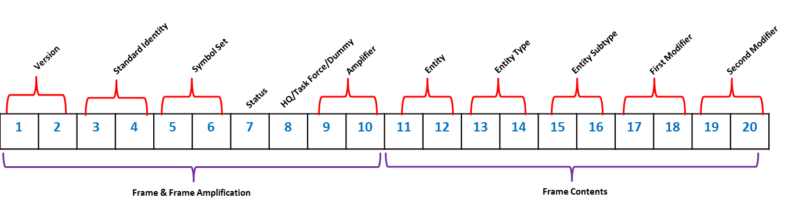

## Core ##

The core schema file defines simple and complex types, attribute groups, and a definition for the Tags element.  The items defined in this file are used by other elements in the base and symbol set schema files.

## Library (Base) ##

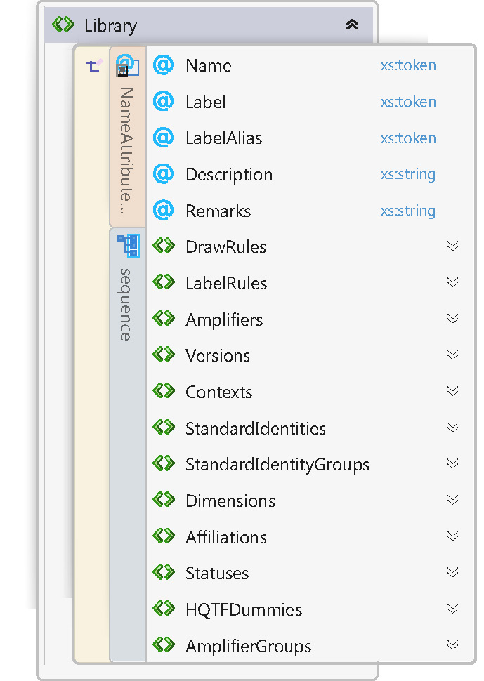

The base document contains definitions for the basic elements needed to define a symbol, specifically, the information encoded in the first ten digits of a symbol's SIDC.

The root element for this schema is "Library".  A Library, like most of the elements in JMSML, can contain a Name (alternatively "ID", which must be unique), Label (a sentence case user-friendly name for the element), Description, and Remarks.  Some elements in JMSML also have a LabelAlias attribute, so an alternative label string can be specified.

The Geometries collection is a work in progress and will contain a definition for a collection of implementation independent basic geometric shapes, used to assist in defining the geometric constraints on control measures in the standards.

The DrawRules collection is a work in progress and will contain a definition for a collection of implementation independent drawing rules/exceptions, used to define how various control measures should be drawn.  Entities will, in future, reference these DrawRules, which in turn will reference a single Geometry.

The LabelRules collection is a work in progress and will contain a definition for a collection of implementation independent placement rules for text amplifiers surrounding military symbology.  Entities will, in future, reference these LabelRules.

The Amplifiers collection consists of a definition for a collection of Amplifier elements, each of which defines one text amplifier, as defined in the main part of the two standards.

The Versions collection consists of a definition for a collection of Version elements, each of which defines a valid option for the version details of any given symbol.

## Context ##

A context is defined in the standards as one of three values, Reality, Exercise, or Simulation.  The Contexts collection in the schema defines a set of Context elements, each of which representing one of these valid context choices.

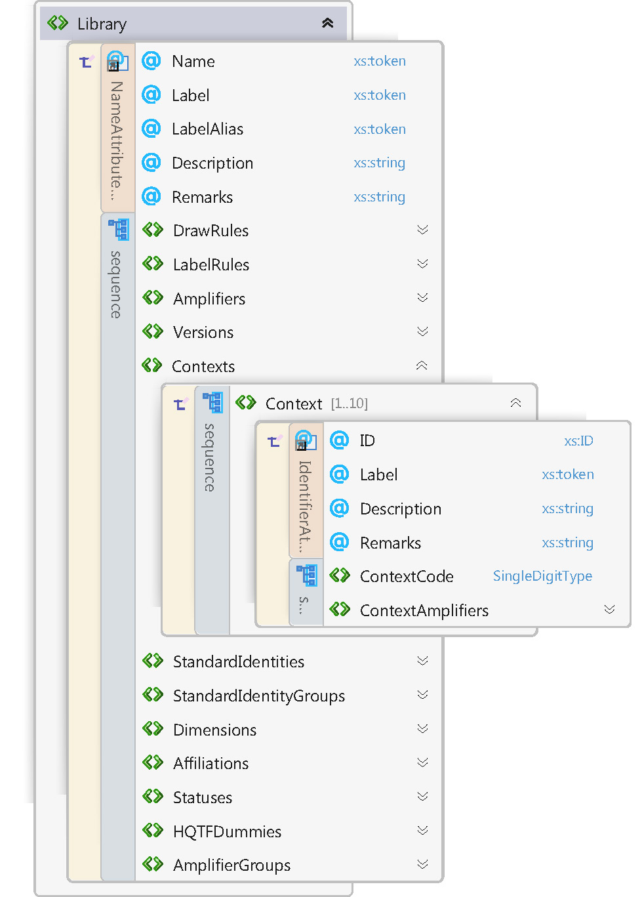

## Standard Identity ##

Standard identity is defined in the standards as a set of values, one of which can be used to define the allegiance or supposed allegiance of the military object being represented. It's used to determine how to draw a given symbol.  The StandardIdentitys collection defines a set of elements that encapsulate standard identity in the standards.

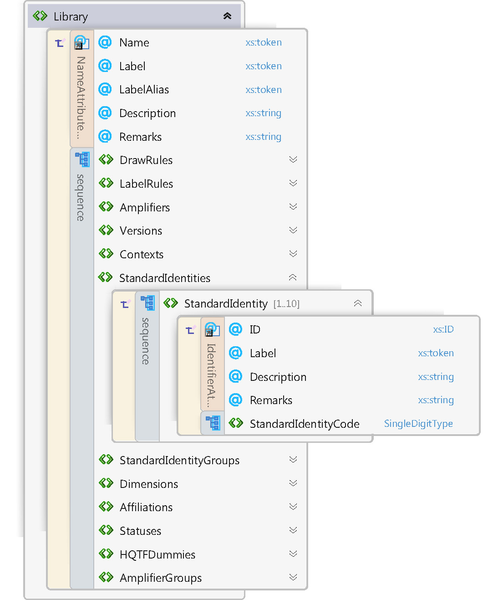

The two standards, informally, categorize standard identities into four distinct groups, based on a common frame shape (Unknown, Friend, Neutral, and Hostile).  

The StandardIdentityGroups collection defines a set of elements designed to represent these standard identity groups.

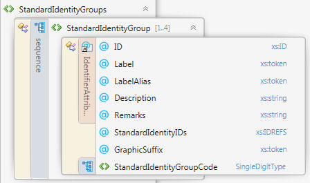

## Dimension ##

Dimension in the standards help define the frame shape of a military symbol.  Dimensions consist of multiple symbol sets.  For example, the Air dimension contains the Air and Air Missile symbol sets, whose symbols are all drawn using the same frame shapes.  Dimensions also define a set of Fields, data that helps map the generic Amplifiers list in the  Library element to dimension or battle space specific message/database fields.

The Dimensions collection defines a set of Dimension elements, each of which encapsulates the standard's concept of a dimension or battle space characteristic.

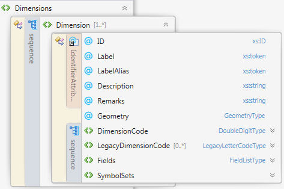

## Affiliation ##

The standards contain three tables, each table represents a single context.  Each context table shows the frames that should be used based on a given standard identity and dimension.  

JMSML uses an Affiliation to map elements belonging to each of those three types (Context, StandardIdentity, and Dimension) Each Affiliation element then points to a specific frame svg file.

The Affiliations collection defines a set of Affiliation elements that establishes these relationships between a given Context, StandardIdentity, and Dimension. 

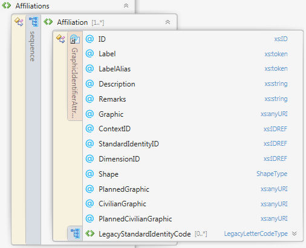

## Status and Amplifiers ##

Other collections within the Library root element define additional elements representing various concepts within the standards.  Namely, values and relationship rules for status (present vs. anticipated/planned, capability, or capacity), HQ/task force/feint-dummy, and graphic amplifiers, such as echelon, mobility, and auxiliary equipment.

The elements representing these concepts include attributes that help identify and describe each instance, provide their SIDC code(s), and legacy support information for backwards compatibility with older versions of the standards.  A reference to the relevant svg file(s) for each element helps guide implementers in knowing which graphics to use when building compound, multi-layer symbols.

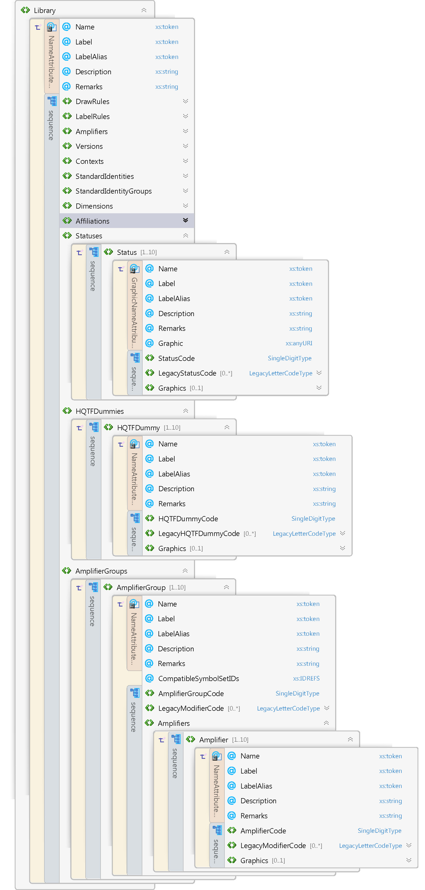

## Symbol Set ##

Each symbol set defined in the standard is represented by a separate XML file.  Each of these XML files adhere to the schema for symbol sets.  Each Dimension in the Library's Dimension's collection contains one or more SymbolSetRef elements.  These "symbol set references" reference or point to one of these external symbol set XML files. 

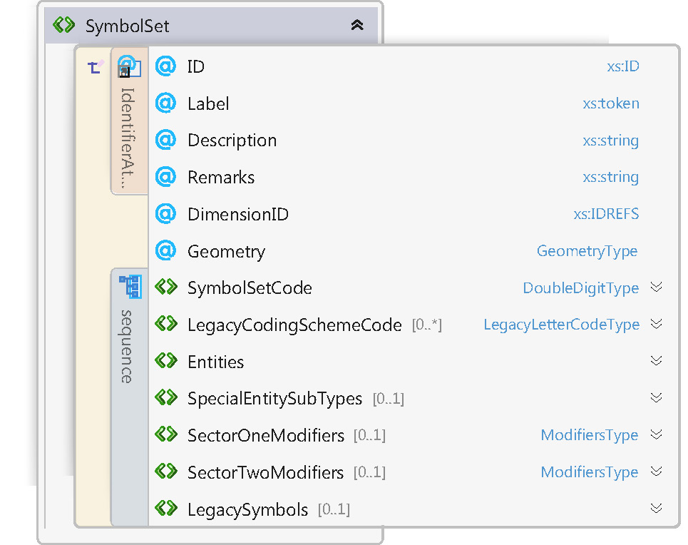

## Entities ##

Each symbol set file contains a collection of Entities.  Each Entity element in turn can contain a collection of EntityType elements.  Each EntityType element can, in turn, contain a collection of EntitySubType elements.

These three types of "entity" are all mostly equivalent in their structure.  Each can point to a given svg file.  In cases where the "entity" represents an icon that touches a frame's edge, there has to be four separate svg files referenced.  One for each of the four StandardIdentityGroups.  While there is currently a naming convention in place for these variations on an svg, that naming convention could change in the future, thus processing JMSML XML cannot rely on parsing rules that are outside the schema's definition itself.

The standards specify that the Land Unit symbol set contains a collection of four special entity subtypes.  These four icons are full-frame and used to further modify an entity type with either an indicator for HQ element, division and below support, corps support, or echelons above corps support.

The symbol set schema includes a SpecialEntitySubtypes collection that defines these special entity subtypes.  As these are all full frame icons, each entry has to point to four different svg files (see the aforementioned explanation).

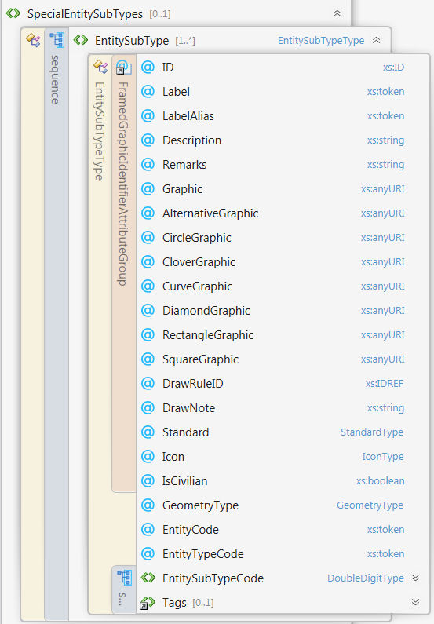

All forms of "entity" support the inclusion of tags through their respective Tags collection.  A Tag allows an implementer to store a set of key words or other implementation specific data values on any particular element instance.

## Modifiers ##

Within the SymbolSet schema, there are two collections of Modifier elements.  The SectorOneModifiers collection defines the set of Modifier elements permissible as sector one icons for the given symbol set.  The SectorTwoModifiers collection defines the set of Modifier elements permissible as sector two icons for the given symbol set.

Modifier elements are defined to point at specific svg files, so implementers can build the appropriate compound, multi-layered, symbol from relevant components.

LimitUseTo is a special attribute on Modifier elements that can hold a space separated list of "entity" IDs, indicating which "entitites" may be permissibly used with that particular modifier.

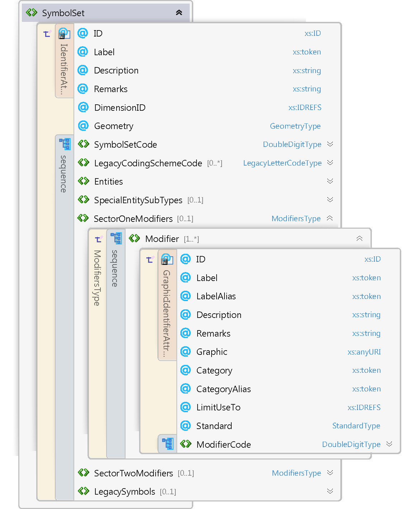

## Legacy Support ##

Backward compatibility with MIL-STD 2525C, and the means to convert SIDCs back and forth between old and new standards, is an important goal for creating this schema and XML database in the first place.

Sprinkled throughout this set of schema files are definitions for "legacy" codes.  The JMSML C# API uses this "legacy" information to parse and then convert SIDCs built for the older standards into SIDCs built for the newer standards, and back again (where two-way conversion is feasible).

Given the open-ended nature of the latest standards, in terms of adding sector one and two modifiers to create innumerable possible symbols, the task of converting between 20 digit SIDC and 15 character SIDC is non-trivial.  The LegacySymbols collection in a given symbol set defines the list of LegacySymbol elements for older standard support.

A given LegacySymbol element consists of references to the unique IDs of Entity, EntityType, EntitySubType, and Modifier elements defined elsewhere in the same symbol set.  Those various elements are the ones that would be needed to build, in 2525D, the older version of these symbols.  Each LegacySymbol element also contains a LegacyFunctionCode, which is the six-character function ID code from the older 15-character SIDC.  This function code, when composed together with the legacy codes found elsewhere in the defined XML hierarchy, is used by the JMSML C# API to convert back and forth between old and new standards.

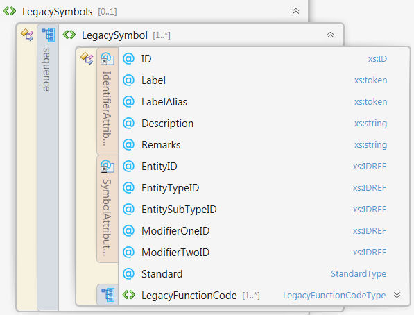

## More Information ##

For more specific detailed technical information regarding the core schema, please click [here](core.html).

For more specific detailed technical information regarding the base (Library) schema, please click [here](base.html).

For more specific detailed technical information regarding the symbol set schema, please click [here](symbolSet.html).
 
