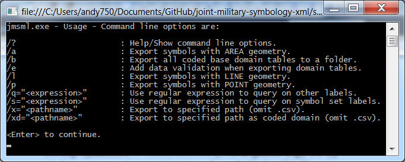

# joint-military-symbology-xml #

## Samples ##

This samples folder contains sample output from the tools included in this repo.  This document explains how these files were generated.

Usage for the jmsml console application is:

### All_Entities.csv. All_Modifier_Ones.csv and All_Modifier_Twos,csv ###
Generate a simple output of entities and modifiers using the following jmsml command line arguments, to export all of the current contents of the JMSML library:

	jmsml.exe /xe="All"

### Air_Entities.csv, Air_Modifier_Ones.csv, and Air_Modifier_Twos.csv ###
Generate a simple output of entities and modifiers using the following jmsml command line arguments, to extract just the contents of the Air symbol set from the JMSML library:

	jmsml.exe /xe="Air" /s="^Air$"

### LightAir_Entities.csv, LightAir_Modifier_Ones.csv and LightAir_Modifier_Twos.csv ###
Generate a simple output of entities and modifiers using the following jmsml command line arguments, to extract just the contents of the Air symbol set, where the label and/or category information contains the word "Light".

	jmsml.exe /xe="Air" /s="^Air$" /q="Light"

### Coded Domain Tables ###
The coded domain tables are comma separated files that have been exported from the JMSML library, for use by developers who need a straightforward dump of its contents.  It contains the label attribute and SIDC code for each element in the standard, exported to multiple files.  The /b switch value should be the location (folder) in which you want the files placed.

The optional /e switch causes the coded domain table export to add additional data validation information to the output.

	jmsml.exe /b=".'
	jmsml.exe /b="." /e

### Coded Domain Entity/Modifier Tables ###
Coded domain tables for entities and modifiers can be generated with or without the same optional filters/regular expressions documented above (with the /s, /q, /a, /l, and /p switches) by specifying the /xs="DOMAIN" switch.

	jmsml.exe /xe="All_Coded_Domain" /xas="DOMAIN"
	jmsml.exe /xe="Air_Coded_Domain" /s="^Air$" /xas="DOMAIN"

Coded domain tables for frames, amplifiers, and HQ/TF/FD can also be generated using /xas="DOMAIN" with the /xf, /xa, and /xh switches, respectively, which are further documented below.

### Image File, Name, Category, Tags Tables ###
The information exported in these files includes that which can be used to generate ArcGIS Style files.  The information includes the path and name of each graphic/image file for a symbol, its name, the category of icon it belongs to, and a semicolon delimited list of tag values that users can use to find a given symbol.  Use the /xas="IMAGE" switch to enable this type of output.

The /s, /q, /a, /l, and /p switches documented above are also respected.  /+ can be used to tell the exporter to append the modifier output to the end of the entity output.

	jmsml.exe /xe="Military-Air-Source-Icons" /s="Air" /xas="IMAGE"
	jmsml.exe /xe="Military-Air-Source-Icons" /s="Air" /+ /xas="IMAGE"

Frame image file/name/category/tags information can be exported with the /xf switch.  Use optional switches /qc, /qd, and /qi to provide regular expressions to filter on Context, Dimension, and Standard Identity respectively.

	jmsml.exe /xf="Military-Frame-Source-Icons" /xas="IMAGE"
	jmsml.exe /xf="Military-Reality-Frame-Source-Icons" /qc="Reality" /xas="IMAGE"

The /-source switch can be used to disable the export of source image file information, for production purposes.

Amplifiers (Echelon, Mobility, and Auxiliary Equipment) can be exported with the /xa switch.  The /-source switch can be used to disable the export of source file information and the /+ switch can be used to force output to be appended to an existing export file.

	jmsml.exe /xa="Military-Amplifier-Source-Icons" /xas="IMAGE"
	jmsml.exe /xa="Military-Frame-And-Amplifier-Icons" /-source /+ /xas="IMAGE"

HQTFFD (Headquarter, Task Force, and Feint/Dummy) amplifiers can be exported with the /xh switch.  The /-source switch can be used to disable the export of source file information and the /+ switch can be used to force output to be appended to an existing export file.

	jmsml.exe /xh="Military-Frame-And-Amplifier-Icons" /+ /xas="IMAGE"